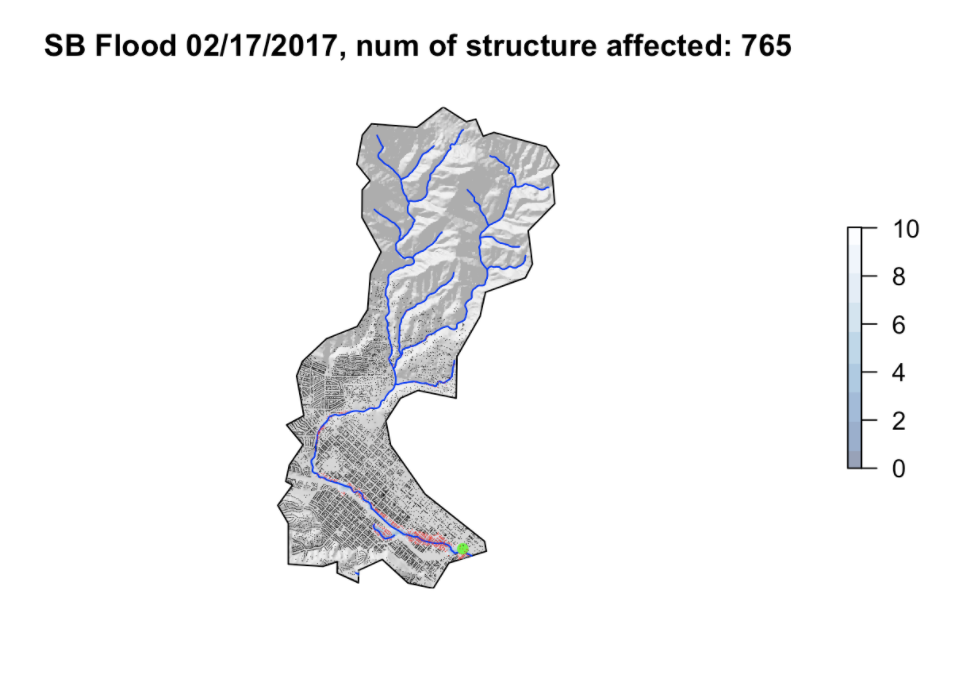

## UCSB Research and Course Work
  All Work Done Through R Studio and ArcMap Pro
 
****

****

### Project 1
### [COVID-19 Data Analysis](https://jacobbraslaw.github.io/geog-176A-labs/lab-02.html)
- Found "safe" counties in California

- Found highest cumulative, daily new, and 7 day rolling average of cases by county

- Look at state level data in total cases and per capita

{width=60%}

****

### Project 2
### [U.S Border Statistics](https://jacobbraslaw.github.io/geog-176A-labs/lab-03.html)

- Looks at areas and populations within 100 miles from any US Border

- Majority of Americans live within 100 miles of the national border
<<<<<<< HEAD

- Identify every city in which US Border Patrol has jurisdiction

{width=60%}

****
### Project 3
### [US National Dam Tessalations](https://jacobbraslaw.github.io/geog-176A-labs/lab-04.html)

- Look at different tessalations of US County lines to identify modifiable arial unit problems

- Analysis on dams to find where the highest dam counts are based on uses of dams

- Point in polygon function to idenditfy number of dams in counties

{width=60%}

****
### Project 4
### [Raster Flood Analysis](https://jacobbraslaw.github.io/geog-176A-labs/lab-05.html)

- Read in web based landsat imagery of Palo, Iowa during a flood with the goal of locating flooded regions

- Using remote sensing data, function created to manipulated bands in satelite images to produce water oriented raster images

- Tested 5 different flooding index function and compared accuracy

{width=60%}
****

### Project 5
### [Flood Risk in Mission Creek](https://jacobbraslaw.github.io/geog-176A-labs/lab-06.html)

- Analyzed the Santa Barbara basin to understand how floods will effect infastructure

- Using raster and vector data all points within basin can be indentified relative to nearest stream elevation

- GIF created that shows flooding effects at 20 different flood levels

{width=60%}

**** 

### Project 6
### [Wind Turbine Power Density Analysis](https://www.linkedin.com/feed/update/urn:li:activity:6680312682991747072/)

- Determined the effect of land factors on power density (w/m^2^) of wind turbines with regression analysis

- From analysis, located ideal place to construct future wind turbine facility to meet needs of Kern County

{width=60%}

****
### Project 7
### [Arizona Solar Panels](https://storymaps.arcgis.com/stories/5b465fe567d24cd2959fbd4d54a4fd38) 

- Based on data layers from electrical grids, wildlife, DEM, solar radiation, and cities a solar suitabilty map was generated.

- Ideal location for photovoltaic panels was determined based upon the generated suitability data layer.

{width=60%}

****
### Project 8 
### [Do Baseball Players Earn Their Salary?](https://jacobbraslaw.github.io/geog-176A-labs/lab-stats.html)

- Used 2016 offensive hitting statistics and salary data to compare high and low paid players

- Analysis used T-test, Wilcox Rank Sum, Linear Models, ANOVA, Tukey-Kramer, Generalized Linear Models

- conclusion: As MLB hall of famer Jeff Kent once said, "the money lies in the RBI's"

{width=60%}

