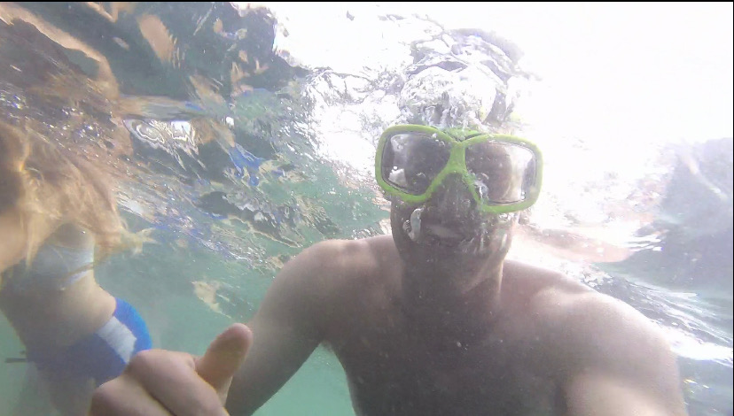

# Hi, I'm Jacob Braslaw.

  I am a fourth year Environmental Science major at UC Santa Barbara. My interests are in large scale environmental action and medicine. In regards to environmental science my areas of study are primarily in renewable energy and GIS. I have worked with renewable energy designs and implementations through UCSB's Clean Energy Transformation Lab (CET Lab) run by Professor Deshmukh. I also currently work as teaching assistant for a Environmental Studies 115, Energy and the Environment.  

  When I am not in the library(currently my shelter in place room) working, I am often seen on the baseball field as a member of UCSB Club Baseball or found out at Sands Beach surfing through sunset with my friends! 
 
****
****
 

****

****

